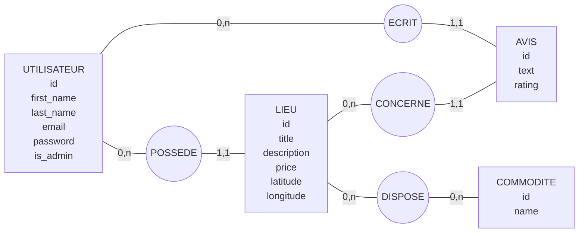
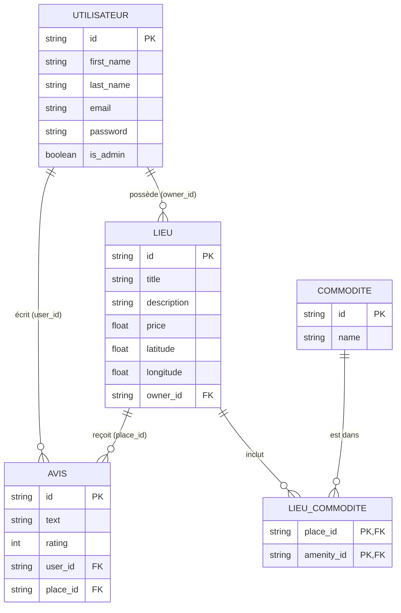

## Architecture de la Base de Données (Méthode Merise)

### 1. Modèle Conceptuel de Données (MCD)
Ce diagramme illustre les règles de gestion métier et les cardinalités (0,n / 1,1) entre nos entités.

### 2. Modèle Logique de Données (MLD)
Ce diagramme traduit le MCD en tables relationnelles prêtes pour SQL, avec l'apparition des Clés Étrangères (FK) et de la table d'association `LIEU_COMMODITE` issue de la relation "0,n --- 0,n".

